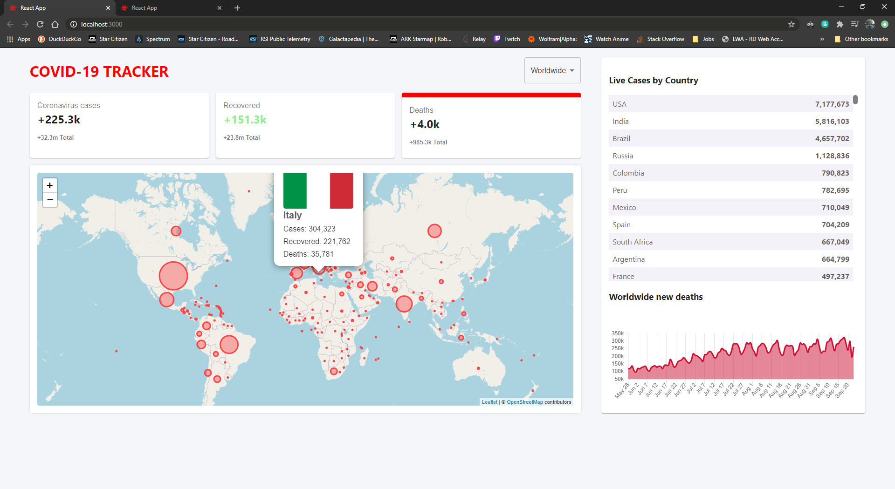
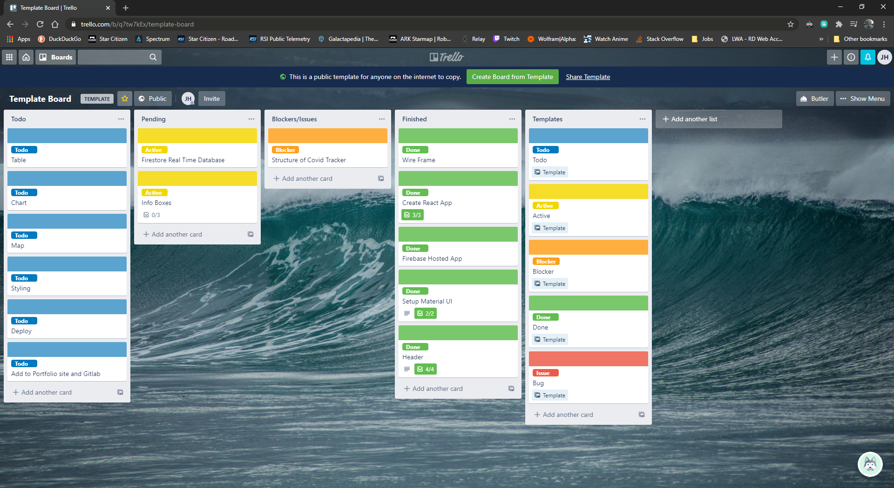
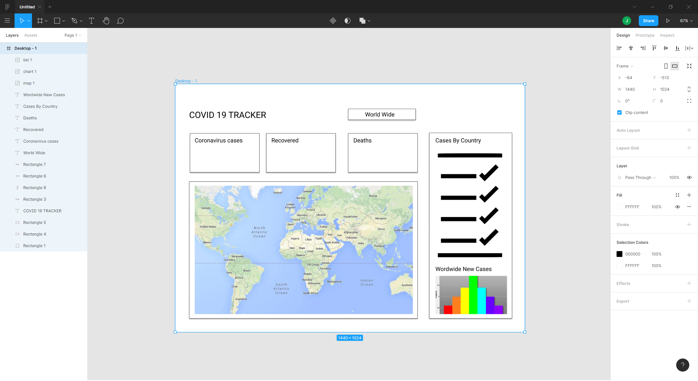

# Covid 19 Tracker (CCP Virus/Wuhan Flu)

React based web app hosted on Firebase pulling live Covid 19 data and rendering statistics in an informative layout with dynamic real time database. Live map view and top stats cards.

Hosted on firebase here: 

Check my portfolio of other projects here: http://jharrison-portfolio.42web.io/#banner

Check my trello here: https://trello.com/b/q7tw7kEx/template-board

## Screenshot of app in action

## Screenshot of active trello

## Screenshot of wireframe mock-up

